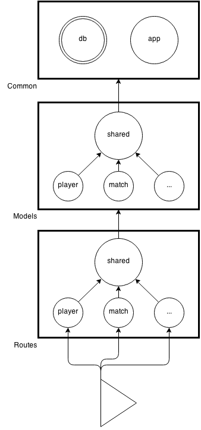

# Friends Against Humanity
A card game API. The android app is [here](https://github.com/25cf/friends-against-humanity-android).

## Table of Contents
1. [Development Setup](#development-setup)
2. [Game Logic](#game-logic)
3. [Testing](#testing)
4. [Directory Structure](#directory-structure)
5. [Import Structure](#import-structure)
6. [Models](#models)

##  Development Setup
Make a new virtual env. Then,
<pre><code>(venv) $ pip install -r requirements.txt</code></pre>

Make sure postgres.app is open.
<pre><code>(venv) $ createdb fah_dev
(venv) $ export DATABASE_URL=postgresql://localhost/fah_dev
(venv) $ export APP_SETTINGS=config.DevelopmentConfig</code></pre>

Make the app executable. (less typing)
<pre><code>(venv) $ chmod +x app.py</code></pre>

Run the app:
<pre><code>(venv) $ ./app.py</code></pre>

Load cards:
<pre><code>(venv) $ python scaffolds/card_scaffold.py</code></pre>

To destroy the database:
<pre><code>(venv) $ dropdb fah_dev</code></pre>

##  Game Logic
1. create match with n player limit and m score limit
1. host invites >= n people
1. n - 1 people join
1. new round begins
	- previous round is stored (none)
	- hands are filled with 10 cards
	- main card is played
	- judge is selected
1. people put down cards
1. when the last person puts down his card, a new round begins (step 4)
1. previous round is stored and returned when requested
1. game ends when any player reaches m points

##  Testing
A basic Postman test suite is located in the tests directory.

##  Directory Structure
- /cards/: raw text file of cards for test purposes
- /tests/: basic tests
- /scaffolds/: db initialization scripts
- /models/: contains ORM models
- /routes/: controllers and routes
- /app.py: runs the server

##  Import Structure

##  Models
#### Cards

|text  |white  |answers|rank   |meta
|------|-------|-------|-------|------
|String|Boolean|Integer|Integer|String

#### Player
|player_type|username|email |password|first_name|last_name|
|-----------|--------|------|--------|----------|---------|
|String     |String  |String|String  |String    |String   |

|losses |hosting|wins |friends|states|
|-------|-------|-----|-------|------|
|Integer|Match  |Match|Player |State |

#### Match
|status|state|pending|winner|deck |black|previous_round|
|------|-----|-------|------|-----|-----|--------------|
|String|State|Player |Player|Cards|Cards|Pickle        |

#### State
|player|match|score  |hand   |played|judged |judge  |round_winner|viewed_round_end|
|------|-----|-------|-------|------|-------|-------|------------|----------------|
|Player|Match|Integer|Cards  |Cards |Integer|Boolean|Boolean     |Boolean         |
