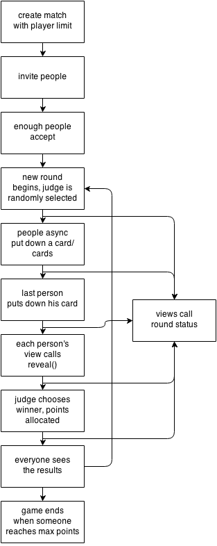

# Friends Against Humanity
A card game API. The android app is [here](https://github.com/25cf/friends-against-humanity-android).

## Development Setup
Make a new virtual env. Then,
<pre><code>(venv) $ pip install -r requirements.txt</code></pre>

Make sure postgres.app is open.
<pre><code>(venv) $ createdb fah_dev
(venv) $ export DATABASE_URL=postgresql://localhost/fah_dev
(venv) $ export APP_SETTINGS=config.DevelopmentConfig</code></pre>

Make the app executable. (less typing)
<pre><code>(venv) $ chmod +x app.py</code></pre>

Run the app:
<pre><code>(venv) $ ./app.py</code></pre>

Load cards:
<pre><code>(venv) $ python scaffolds/card_scaffold.py</code></pre>

To destroy the database:
<pre><code>(venv) $ dropdb fah_dev</code></pre>

## Game Logic

## Testing
We use [Postman](www.getpostman.com) for testing. A basic test suite is located in the tests directory.

## Directory Structure
- /cards/: raw text file of cards for test purposes
- /tests/: basic tests
- /scaffolds/: db initialization scripts
- /models/: contains ORM models
- /routes/: controllers and routes
- /app.py: runs the server

## Import Structure

## API Architecture
#### Cards

|text  |white  |answers|rank   |meta
|------|-------|-------|-------|------
|String|Boolean|Integer|Integer|String

#### Player
- hosting: one-to-many relationship with Match (backref: host)
- wins: one-to-many relationship with Match (backref: winner)
- friends: many-to-many relationship with Player
- states: one-to-many relationship with State (backref: player)

|username|password|email |first_name|last_name|losses |hosting|wins |friends|states|
|--------|--------|------|----------|---------|-------|-------|-----|-------|------|
|String  |Hash    |String|String    |String   |Integer|Match  |Match|Player |State |

#### Match
- status: PENDING | ONGOING | ENDED
- OTM: A match has many states, but a state can only have one match.
- MTM: A match can have many pending players, and a pending player can have many pending matches.
- MTO: A match only has one winner, but a winner can have many won matches.
- MTM: A match has many cards in a deck, and cards can have many decks in many matches.
- MTO: A match has one black card at any time, but a black card can be in many matches.

|status|state|pending|winner|deck |black|
|------|-----|-------|------|-----|-----|
|String|State|Player |Player|Cards|Cards|

#### State
- MTO: A state has one player, but a player can have many states.
- MTO: A state has one match, but a match has many states.
- MTM: A state has a hand with many cards, and cards can belong to many hands in many states.
- MTO: A state has one played card, but a card can have many states in which it is played.

|player|match|score  |hand   |played|judged |
|------|-----|-------|-------|------|-------|
|Player|Match|Integer|Cards  |Cards |Integer|

### Routes
#### Cards
|url       |verb  |description              |
|----------|------|-------------------------|
|/cards/new|POST  |create a new card        |
|/cards/id |GET   |retrieve card info       |
|/cards/id |PUT   |edit card                |
|/cards/id |DELETE|remove card              |
|/cards    |GET   |get all cards (temporary)|

#### Player
|url         |verb  |description                |
|------------|------|---------------------------|
|/players/new|POST  |create a new player        |
|/players/id |GET   |get player info            |
|/players/id |PUT   |update player info         |
|/players/id |DELETE|delete a player            |
|/players    |GET   |get all players (temporary)|

#### Match
|url         |verb|description                |
|------------|----|---------------------------|
|/matches/new|POST|create a new match         |
|/matches/id |GET |get match info             |
|/matches/id |PUT |update match               |
|/matches    |GET |get all matches (temporary)|
